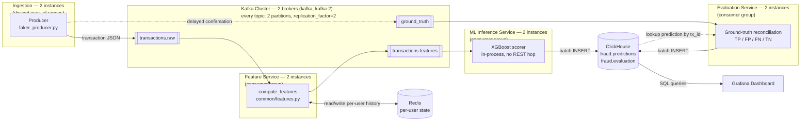

# Real-Time Fraud Detection System — Complete Project Documentation

> This document is written so you can walk into an interview, explain this project end-to-end, and answer follow-up questions confidently. Every non-trivial technical term has a plain-English explanation in brackets the first time it shows up.

---

## 1. Project Overview

### 1.1 What is this project?

A **real-time fraud detection pipeline** — a system that simulates financial transactions happening live, computes behavioral features about each transaction as it arrives, scores it for fraud probability using a trained machine learning model, stores every scored transaction, and visualizes fraud activity on a live dashboard.

Think of it like this: every time someone swipes a card, a fraud engine somewhere has milliseconds to decide "is this normal, or should we block it?" This project is a scaled-down, self-contained version of that kind of system — the same architecture pattern real payment companies (Visa, Stripe, banks) use, built with open-source tools.

### 1.2 Why does this project exist? (the elevator pitch)

Fraud detection has two hard requirements that pull in opposite directions:

1. **It has to be fast** — a decision has to be made in real time, transaction by transaction, not in a nightly batch job.
2. **It has to be smart** — it needs to know a user's *history* (their usual spending amount, usual location, usual merchants) to tell whether *this* transaction looks abnormal for *that specific person*.

This project demonstrates how to solve both: a **streaming pipeline** (data flows continuously through a pipe, processed as it arrives, instead of being collected and processed later in bulk) does the "fast" part, and a **stateful feature engineering layer backed by Redis** (an in-memory database used here to remember per-user history between transactions) does the "smart" part, feeding a pre-trained **XGBoost model** (a fast, tree-based machine learning algorithm, very popular for structured/tabular data like this) that outputs a fraud probability.

### 1.3 The end-to-end flow in one sentence

> A **producer** generates fake but realistic transactions → pushes them onto **Kafka** (a message broker: a system that reliably passes messages from producers to consumers, decoupling the two) → a **consumer** reads each transaction, computes ~29 fraud-relevant features using per-user state stored in **Redis**, calls the **ML service** (a small web API wrapping the trained model) to get a fraud probability → the enriched, scored transaction is written to **ClickHouse** (a columnar database built for fast analytics on large volumes of data) → **Grafana** (a dashboarding/visualization web app) queries ClickHouse continuously to show live charts.

### 1.4 Why this looks good in an interview

This single project touches almost every buzzword a data/backend/ML-adjacent interviewer wants to hear about: event streaming, stateful stream processing, feature engineering, ML model serving, columnar analytics storage, containerized microservices, and observability/dashboarding. It's a genuine **microservices architecture** (an application split into small, independently deployable services that each do one job and talk to each other over the network) — not a single monolithic script.

---

## 2. Tech Stack (and why each piece was chosen)

| Component | Technology | One-liner: what it is | Why it's here |
|---|---|---|---|
| Message broker | **Apache Kafka** | A distributed log that producers write to and consumers read from, decoupling the two sides | Lets the producer and consumer run at different speeds/independently; buffers bursts of transactions |
| Coordination service | **ZooKeeper** | A coordination service Kafka (this version) relies on to manage broker metadata | Required by this version of Kafka (Kafka 7.5 here still uses the older ZooKeeper-based mode, not the newer KRaft mode) |
| In-memory state store | **Redis** | An in-memory key-value database, extremely fast, often used for caching or transient state | Stores each user's running history (average spend, last location, transaction counts) between messages — this is what makes feature engineering "stateful" |
| Data generator | **Faker (Python library)** + custom script | A library that generates realistic fake data (names, locations, etc.) | Simulates a live stream of transactions without needing real financial data |
| ML model | **XGBoost** | "Extreme Gradient Boosting" — an ensemble of decision trees trained sequentially, each correcting the previous one's errors; excellent for structured/tabular data | Industry-standard choice for fraud detection on tabular features; fast to train and to run inference with |
| Model serving | **FastAPI** + **Uvicorn** | FastAPI: a Python web framework for building APIs quickly; Uvicorn: the server that actually runs FastAPI apps | Exposes the trained model as a `/predict` HTTP endpoint the consumer can call |
| Analytics database | **ClickHouse** | An open-source **columnar database** (stores data column-by-column instead of row-by-row, which makes aggregate queries like `AVG()`/`COUNT()` over millions of rows very fast) | Purpose-built for the kind of "how many frauds in the last hour" aggregate queries a dashboard needs |
| Dashboard | **Grafana** | A web application for building live, auto-refreshing charts/dashboards from a database | Turns raw ClickHouse rows into a website you can watch fraud happen on |
| Containerization | **Docker** + **Docker Compose** | Docker: packages an app and everything it needs to run into a portable "container"; Docker Compose: a tool to define and run multiple containers together as one system | Every service (producer, consumer, Kafka, Redis, ClickHouse, Grafana, ML service) runs in its own isolated container, wired together with one config file |

---

## 3. High-Level Design (HLD)

### 3.1 Architecture Diagram


*(ZooKeeper coordinates the 2 Kafka brokers — metadata/leader-election only, not part of the data path, so omitted above to keep the flow readable. It remains a single instance and a separate point of failure from the brokers themselves; see §6.)*

### 3.2 Component responsibilities (the "who does what")

| Service | Container name(s) | Responsibility |
|---|---|---|
| `producer` | `producer-1`, `producer-2` | Each invents realistic transactions (user, amount, merchant, location, GPS coordinates, timestamp) at 12 TX/sec for a disjoint slice of simulated user IDs, publishes to `transactions.raw`, and publishes a delayed ground-truth confirmation to `ground_truth`. Injects fraud at a 2% rate. |
| `zookeeper` | `zookeeper` | Coordinates Kafka broker metadata (leader election, topic configs). Single instance — a separate point of failure from the brokers themselves. |
| `kafka` | `kafka`, `kafka-2` | Two-broker Kafka cluster; every topic has `replication_factor=2`, so losing either broker doesn't lose data or availability (verified — see §6) |
| `redis` | `redis` | Stores per-user rolling state: running mean/variance of spend, last known location/time, transaction counts, location/merchant frequency counts |
| `feature_service` | `feature-service-1`, `feature-service-2` | Consumer group reading `transactions.raw`: computes 29 ML features per transaction using Redis state (`common/features.py`, shared with the offline dataset generator), publishes the enriched record to `transactions.features` |
| `ml_service` | `ml-service-1`, `ml-service-2` | Consumer group reading `transactions.features`: scores each with the XGBoost model **in-process** (no HTTP hop), writes `(probability, predicted_label)` to ClickHouse's `fraud.predictions` |
| `evaluation_service` | `evaluation-service-1`, `evaluation-service-2` | Consumer group reading `ground_truth`: looks up the matching prediction in ClickHouse by `transaction_id`, classifies it TP/FP/FN/TN, writes the result to `fraud.evaluation` — this is what makes live precision/recall measurable |
| `clickhouse` | `clickhouse` | Stores every scored + evaluated transaction permanently, in a schema optimized for fast aggregate queries |
| `grafana` | `grafana` | Auto-provisioned dashboard querying ClickHouse every 10 seconds to show live stats and charts |

### 3.3 Why a pipeline instead of "one script that does everything"?

This is a classic **separation of concerns** interview talking point:

- **Producer and consumer are decoupled by Kafka.** If the consumer crashes or is slow, transactions queue up in Kafka instead of being lost — this is called **backpressure handling**. You could restart the consumer and it resumes from where it left off.
- **The ML model is served independently** (`ml_service`), not imported directly into the consumer's code. This means the model can be updated, scaled, or replaced without touching the streaming/feature-engineering logic — a real-world team would have a separate ML team owning that service.
- **ClickHouse is separate from the operational database (Redis).** Redis holds only the small amount of *live* state needed to score the *next* transaction; ClickHouse holds the full historical record for analytics. Using one database for both would be slow for one of the two use cases.

### 3.4 Data flow — concrete walkthrough of a single transaction

1. A producer creates: `{"user_id": 104, "amount": 414.39, "merchant": "BestBuy", "location": "NY", "lat": 40.7128, "lon": -74.006, "timestamp": "2026-07-19T17:23:34", "transaction_id": "..."}` and publishes it to `transactions.raw`. It also schedules a delayed ground-truth confirmation (5-30s later) to the `ground_truth` topic, simulating how real fraud confirmations lag behind the transaction itself.
2. A `feature-service` instance (one of 2, in `feature-service-group`) picks it up.
3. It fetches user 104's stored history from Redis (e.g., "average spend $320, last seen in NY 3 hours ago, home location NY") and computes 29 features — is this amount unusually high for this user? (**z-score**: a statistics measure of how many standard deviations a value is from the mean) Is the travel speed since the last transaction physically impossible? Is this a new merchant? Is it night time? Etc.
4. It updates Redis with this transaction's info (new running average, new last-seen location, etc.) so the *next* transaction from user 104 sees fresh history, then publishes the enriched record to `transactions.features`.
5. An `ml-service` instance (one of 2, in `ml-service-group`) picks it up, runs the XGBoost model **in-process** (no HTTP hop — the model is loaded once at startup), and gets `{"probability": 0.18, "predicted_label": 0}` using the metadata-configured threshold.
6. It batches scored rows (100 rows or 2 seconds, whichever first) and bulk-inserts into ClickHouse's `fraud.predictions` table.
7. Separately, once the delayed ground-truth message for this transaction arrives on `ground_truth`, an `evaluation-service` instance looks up the matching row in `fraud.predictions` by `transaction_id`, classifies it TP/FP/FN/TN against the actual label, and inserts the result into `fraud.evaluation` — this closed loop is what makes live precision/recall measurable at all (see `THRESHOLD_RECALIBRATION_REPORT.md`).
8. Grafana, refreshing every 10 seconds, re-runs its SQL queries against ClickHouse and the charts update.

---

## 4. Low-Level Design (LLD)

### 4.1 Producer — `producer/faker_producer.py`

**Purpose:** simulate a realistic, continuous stream of card transactions, including a small percentage of clearly fraudulent ones, without any real user data.

Key logic:
- Maintains an in-process dictionary `user_profiles` for ~50 simulated users (IDs 100–150), each with a home location, preferred merchants, and last transaction time — this is *separate* from the consumer's Redis state; the producer just uses it to generate believable behavior, not to do any fraud detection itself.
- Generates 50 transactions/second (`TX_PER_SECOND = 50`), sleeping 1 second between bursts.
- **5% of transactions** are deliberately fraudulent: a location far from the user's home, a high-risk merchant (`Casino`, `Foreign_Site`, `Luxury_Store`), and an inflated amount ($1000–$8000).
- Uses the **Haversine formula** (a formula that calculates the great-circle distance between two GPS coordinates on a sphere, i.e., "as the crow flies" distance) to sanity-check that normal (non-fraud) transactions don't imply impossible travel speeds — if they would, it snaps the location back to the user's home.
- Publishes each transaction as a JSON message to the Kafka topic `transactions` using the `kafka-python` library's `KafkaProducer`.
- Retries Kafka connection up to 10 times with a 2-second backoff on startup (Kafka/ZooKeeper can take a few seconds to become ready).

### 4.2 Kafka topic design

- Single topic: `transactions`.
- Created with `num_partitions=1, replication_factor=1` — deliberately minimal because this is a single-broker, single-consumer demo setup, not a production cluster. (In an interview: **partitions** allow parallel consumption — more partitions would let you run multiple consumer instances in the same **consumer group**, each handling a slice of the traffic, for horizontal scaling. Replication factor > 1 would protect against broker failure — not needed with only one broker.)
- Consumer group: `fraud-consumer`, `auto_offset_reset="latest"` (a new consumer only sees messages produced *after* it started, not the entire backlog — appropriate for a live dashboard use case where you care about "now", not historical replay).

### 4.3 Consumer — `consumer/transactions_consumer.py` (the most important file)

This is a synchronous, single-process Kafka consumer loop. For every message:

**Step 1 — Time-based features** (no state needed): `hour`, `day_of_week`, `is_weekend`, `is_night` (11pm–5am).

**Step 2 — Velocity features using a Redis Sorted Set** (a Redis data structure that stores members ordered by a numeric score — here, the score is the transaction's Unix timestamp):
- Key: `user:{id}:tx_times`.
- `ZCOUNT` (count members whose score falls in a range) counts how many of that user's *past* transactions (strictly before this one) fall in the last 1 hour / 24 hours → `tx_count_1h`, `tx_count_24h`.
- Only *after* counting is the current transaction's own timestamp added (`ZADD`) — this matters, because the training data generator counts velocity the same "before this transaction" way, and anything older than 24h is trimmed (`ZREMRANGEBYSCORE`) so the set doesn't grow forever.

**Step 3 — Per-user running state, stored in a Redis Hash** (a Redis data structure like a mini dictionary/object, key `user:{id}:state`):
- `tx_count` (count of *prior* transactions, not including this one), running sum and sum-of-squares of amount (`total_amount`, `total_amount_sq` — see the z-score formula below), last latitude/longitude/timestamp/location, and `home_location` (recomputed each time as the user's *most frequent* location so far, not just the first one seen).
- There's no separate "first transaction" branch — a brand-new user simply has an empty Redis hash, and every `.get(field, default)` naturally falls back to the same defaults the training generator's fresh in-memory dict would have (0 counts, `None` for "no last location yet", etc.). This mirrors `dataset_generator.py`'s `build_features()` exactly, which also has one unified formula path rather than a special-cased cold start.

**Step 4 — Amount anomaly (z-score) features**, computed only once a user has more than 5 prior transactions (matching the training data's own rule — too little history makes a z-score meaningless):
```
avg = total_amount / tx_count
variance = (total_amount_sq / tx_count) - avg**2
std = max(variance, 0) ** 0.5
amount_zscore = (amount - avg) / max(std, 1.0)   # std floored at 1.0 to avoid blow-ups
```
Important subtlety: **`total_amount`/`total_amount_sq`/`tx_count` reflect history strictly *before* this transaction** — otherwise every transaction would be compared against a baseline that already includes itself, which would understate how anomalous it really is. Redis state is updated *after* all features for the current transaction are computed.

**Step 5 — Location & travel features:**
- `distance_from_last_tx` via the Haversine formula (capped at 20,000 km).
- `travel_speed = distance / hours_since_last_tx` (capped at 10,000 km/h).
- `is_impossible_travel = 1` if that implied speed exceeds **800 km/h** (faster than a commercial jet) — a classic, intuitive fraud signal: "this person can't physically be in two far-apart places within that time gap."
- `location_mismatch_home` / `location_mismatch_last`, `location_frequency` (what fraction of this user's past transactions were at this same location), `is_new_location`.
- `home_location` isn't fixed at the user's first-ever location — it's **recomputed after every transaction** as whichever location has the highest running count for that user (an evolving "mode", not a frozen first-seen value).

**Step 6 — Merchant features:** `merchant_risk` is a **3-level scale** (3 = high-risk: `Casino`, `Foreign_Site`; 2 = medium-risk: `Luxury_Store`, `Electronics_Hub`; 1 = everything else), `merchant_frequency`, `is_new_merchant` — same frequency-counting pattern as location, using a second Redis hash (`user:{id}:merch_counts`).

**Step 7 — Call the ML service:** builds a dict of exactly the 29 features the model expects (order doesn't matter for a dict, but the *names* must match exactly) and does a synchronous `POST` to `http://ml_service:8000/predict`.

**Step 8 — Batch insert into ClickHouse:** rather than doing one `INSERT` per transaction (which would be extremely slow for a columnar database — ClickHouse is optimized for **bulk inserts**, not high-frequency single-row writes), the consumer buffers scored rows in memory and flushes when either:
- the buffer reaches 100 rows, **or**
- 2 seconds have passed since the last flush

whichever happens first. This is a standard **micro-batching** pattern used to trade a small amount of latency for a large gain in write throughput.

**Resilience:** on startup, the consumer waits/retries (up to 15 attempts, 2s apart) for `ml_service`, Redis, ClickHouse, and Kafka to become reachable, since Docker Compose starts containers concurrently and there's no guarantee of ordering readiness (only container *start* ordering, via `depends_on`).

### 4.4 ML Service — `ml_service/app.py`

- A minimal FastAPI app with two endpoints:
  - `POST /predict` — accepts a JSON body matching the `Transaction` Pydantic model (Pydantic: a Python library for declaring and validating the shape/types of data) with all 29 features, builds an XGBoost **DMatrix** (XGBoost's optimized internal data structure for feeding data to the model), runs `model.predict()`, and compares the resulting probability against a pre-computed **optimal threshold** (currently 0.7867, recalibrated for live fraud prevalence — see 4.5) to produce a binary `prediction` (0 or 1) alongside the raw `probability`.
  - `GET /health` — used by Docker's `healthcheck` and by the consumer's startup wait-loop.
- The model file (`fraud_model.json`) and metadata (`model_metadata.json`) are mounted into the container as **read-only volumes** rather than baked into the image — meaning you can swap in a retrained model by replacing the file on the host, without rebuilding the Docker image.
- Loads once at process startup (not per-request) — model loading is the expensive part, so it's done exactly once and reused for every request.

### 4.5 The Model — training, features, and metrics

The model itself was trained **outside this repository's runtime path** — this project ships the *already-trained* model (`fraud_detection_model.json`) plus a `Syn_dataset.zip` containing the synthetic training data (`fraud_dataset_5l.csv`, 500,000 rows — "5L" is Indian numbering shorthand for 5 *lakh* = 500,000) and the generator script used to build it (`dataset_generator.py`).

**Algorithm:** XGBoost (gradient-boosted decision trees). Key training hyperparameters from `model_metadata.json`:
- `n_estimators=300` (300 trees), `max_depth=6`, `learning_rate=0.05`
- `scale_pos_weight≈6.66` — a technique to compensate for **class imbalance** (fraud is much rarer than legitimate transactions in the training data — roughly 1-in-7 weighting tells the model "treat missing a fraud case as ~6.66x worse than a false alarm")
- `eval_metric="auc"` with `early_stopping_rounds=30` (stop training once validation performance stops improving for 30 rounds, to avoid **overfitting** — memorizing the training data instead of learning generalizable patterns)

**The 29 features** (grouped, matching `model_metadata.json`'s `feature_columns`):
- *Amount:* `amount`, `amount_log` (log-transformed, since raw dollar amounts are heavily right-skewed), `amount_zscore`, `amount_ratio_to_avg`, `is_round_amount`, `is_very_high`
- *Time:* `hour`, `day_of_week`, `is_weekend`, `is_night`
- *Recency/velocity:* `hours_since_last_tx`, `hours_since_last_tx_log`, `is_rapid_tx`, `tx_count_1h`, `tx_count_24h`, `total_tx_count`, `is_first_tx`
- *Location:* `location_mismatch_home`, `location_mismatch_last`, `distance_from_last_tx`, `distance_from_last_tx_log`, `travel_speed`, `travel_speed_log`, `is_impossible_travel`, `location_frequency`, `is_new_location`
- *Merchant:* `merchant_risk`, `merchant_frequency`, `is_new_merchant`

**Reported performance** (from `model_metadata.json`, on the original held-out test set, which has a **13% fraud rate** — see the calibration note below for why that number matters):

| Metric | Value | Plain meaning |
|---|---|---|
| **AUC** (Area Under the ROC Curve) | 0.842 | Probability the model ranks a random fraud case as riskier than a random legit case; 0.5 = coin flip, 1.0 = perfect |
| **AP** (Average Precision) | 0.460 | Similar to AUC but more informative on imbalanced data — summarizes the precision/recall curve |
| **Optimal F1** | 0.432 | Harmonic mean of precision and recall at the chosen threshold — balances "catching fraud" vs "not crying wolf" |
| **Precision** | 0.295 | Of everything flagged as fraud, ~29.5% actually was fraud — **on the 13%-fraud test set only, see below** |
| **Recall** | 0.806 | Of all actual fraud, the model catches ~80.6% of it |
| **False alarm rate** | 0.292 | ~29.2% of legitimate transactions get incorrectly flagged |

**Independently reproduced (not just taken on faith):** the model file was reloaded and re-scored against the full 500k-row `fraud_dataset_5l.csv` (fraud rate 13.1%) using `sklearn` metrics, outside of this project's runtime. Results matched the reported test metrics closely — **AUC 0.844, F1 0.434, precision 0.296, recall 0.816, false alarm rate 0.293** — confirming the shipped model file and metadata are internally consistent and the reported numbers are genuine, not just aspirational. (Caveat: this re-scoring ran over the same data the model may have been trained on, since the original train/test split indices weren't shipped with the repo — so treat it as a *consistency check*, not an independent validation. `model_metadata.json`'s numbers remain the trustworthy out-of-sample benchmark.)

**Why this precision/recall trade-off is a deliberate, defensible choice (great interview talking point):** in fraud detection, missing real fraud (a **false negative**) is usually far more costly than a false alarm (a **false positive**) — a false alarm might mean a small manual review, while a missed fraud means real money lost. The `scale_pos_weight` and the chosen decision threshold were tuned to **favor recall over precision** — catch a high fraction of fraud even if it means a decent chunk of false alarms. This is the standard trade-off framing to bring up if asked "why not just get 99% accuracy?" — with fraud this rare, a model that predicts "never fraud" would already be >95% accurate and completely useless; **accuracy is the wrong metric** for imbalanced problems like this, which is why AUC/precision/recall/F1 are used instead.

**⚠️ Threshold recalibration — training prevalence vs. live prevalence (important, and a great "what did you debug" interview story):** `dataset_generator.py` injects synthetic fraud at a 5% base rate, which (after probabilistic labeling/noise) yields the ~13% `fraud_label` rate seen above. `producer/faker_producer.py`, which simulates *live* traffic, injects fraud at only **2%**. Recall is prevalence-invariant (it's computed only over the positive class), so it transfers from the 13%-fraud test set to the 2%-fraud live stream basically unchanged. **Precision is not** — it depends on how many legitimate transactions surround each fraud case, so the same model, at the same threshold, looks dramatically worse on precision once deployed against rarer real-world fraud. Concretely, the original threshold (0.51) reprojects via Bayes' theorem (`precision(π) = π·TPR / (π·TPR + (1-π)·FPR)`) from 29.5% precision at 13% prevalence down to **~5.4% precision at 2% prevalence** — matching what was actually observed live. The model itself (`fraud_detection_model.json`, AUC 0.842) was never retrained to fix this — only `optimal_threshold` in `model_metadata.json` was recalibrated (via `scripts/recalibrate_threshold.py`) to **0.7867**, chosen as the threshold maximizing F1 subject to a 10% precision floor *at the real 2% live prevalence*. That trades recall down to ~32% for precision up to ~14% — both figures under `model_metadata.json` → `performance_live_2pct`. Full derivation and proofs: `THRESHOLD_RECALIBRATION_REPORT.md`.

**✅ Train/serve parity (previously a bug, now fixed):** the live consumer's feature engineering (`consumer/transactions_consumer.py`) was rewritten to mirror `dataset_generator.py`'s formulas exactly — `merchant_risk`'s 3-level scale, the `is_night`/`is_round_amount`/`is_very_high` thresholds, the 720-hour and 20,000 km cold-start/cap constants, the 800 km/h impossible-travel threshold, the "history excludes the current transaction" convention for counts/frequencies, and the evolving (mode-based) `home_location` — are now identical on both sides. This was verified by rebuilding the consumer and inspecting live ClickHouse rows (e.g. `merchant_risk` now cleanly maps `Casino`/`Foreign_Site` → 3, `Luxury_Store`/`Electronics_Hub` → 2, everything else → 1, with no stray 0/1 values).

### 4.6 Redis — data model summary

| Key pattern | Type | Purpose |
|---|---|---|
| `user:{id}:state` | Hash | Running stats: prior tx count, amount sum/sum-of-squares, last lat/lon/timestamp/location, home location (recomputed each write) |
| `user:{id}:loc_counts` | Hash | `{location: count}` — for location frequency / new-location detection |
| `user:{id}:merch_counts` | Hash | `{merchant: count}` — for merchant frequency / new-merchant detection |
| `user:{id}:tx_times` | Sorted Set | Timestamps of recent transactions, scored by Unix time, trimmed to a rolling 24h window — for velocity features |

Redis was chosen over just querying ClickHouse for this because **this state needs sub-millisecond read/write for every single transaction**, and it's small, transient, "hot" data — a textbook use case for an in-memory key-value store rather than a disk-backed analytical database.

### 4.7 ClickHouse — schema design

```sql
CREATE TABLE fraud.transactions (
    user_id Int32, amount Float64, merchant String, location String,
    lat Float64, lon Float64, timestamp DateTime,
    ... (all 29 engineered features) ...
    fraud_probability Float64,
    processed_at DateTime DEFAULT now()
)
ENGINE = MergeTree()
ORDER BY (timestamp, user_id)
PARTITION BY toYYYYMM(timestamp);
```

- **`MergeTree`** is ClickHouse's main **storage engine** (the underlying mechanism that decides how data is physically stored, sorted, and merged on disk) — optimized for high insert throughput and fast range/aggregate queries.
- **`ORDER BY (timestamp, user_id)`** defines the **primary sort order** on disk — since almost every dashboard query filters or groups by time, storing data physically sorted by timestamp makes those queries much faster (ClickHouse can skip whole blocks of data that fall outside the queried time range).
- **`PARTITION BY toYYYYMM(timestamp)`** splits the table into physical chunks by month — makes it cheap to drop/archive old data later, and lets ClickHouse skip irrelevant partitions entirely during queries.
- One row per scored transaction — a wide, **denormalized** table (all data in one flat table rather than split across multiple joined tables), which is the standard ClickHouse pattern since **joins are comparatively expensive** in columnar analytical databases; you want to query one table, not join five.

### 4.8 Grafana — dashboard design

- **Datasource:** the official `grafana-clickhouse-datasource` plugin, auto-installed via the `GF_INSTALL_PLUGINS` environment variable, connecting over ClickHouse's **native protocol** on port 9000 (faster, binary protocol, vs. the HTTP interface on port 8123).
- **Provisioning:** both the datasource and the dashboard itself are defined as YAML/JSON files under `grafana/provisioning/` and mounted into the container. This means the whole dashboard is **"infrastructure as code"** (config that lives in version control and is applied automatically) — nobody has to manually click through the Grafana UI to set it up; `docker compose up` reproduces the exact same dashboard every time.
- **Panels:**
  - 4 stat tiles: Total Transactions, Flagged as Fraud, Fraud Rate %, Avg Fraud Probability
  - 2 time-series charts: Transactions per Minute, Avg Fraud Probability per Minute
  - 1 bar gauge: Transactions by Merchant
  - 1 table: Recent High-Risk Transactions (fraud_probability ≥ 0.7867, i.e., the model's tuned threshold — see 4.5)
- Auto-refreshes every 10 seconds, giving the "live" feel.

### 4.9 Docker Compose — how it all gets wired together

- One `docker-compose.yml` at the repo root defines all 8 services on a single custom bridge network (`fraud-net`) — containers can reach each other by service name (e.g., the consumer connects to `kafka:9092`, `redis:6379`, `clickhouse:8123`, `ml_service:8000` — Docker's built-in DNS resolves these names to the right container).
- **`depends_on`** controls *start order* only (e.g., start Redis before the consumer) — it does **not** guarantee the dependency is actually *ready* to accept connections yet, which is exactly why the consumer and producer both implement their own retry/backoff loops rather than trusting `depends_on` alone.
- **Named volumes** (`clickhouse_data`, `grafana_data`) persist data across container restarts — without them, restarting a container would wipe its data since containers are otherwise ephemeral.
- **Healthchecks** (only on `ml_service` in this project) let Docker report a service as "healthy" once its `/health` endpoint responds successfully, not just once the process has started.

---

## 5. Design Decisions & Trade-offs (common interview follow-ups)

**Q: Why Kafka instead of just writing directly from the producer to the consumer, or to the database?**
A: Kafka decouples producer and consumer rates and gives durability — if the consumer is down for maintenance or crashes, transactions aren't lost, they queue up in Kafka and get processed once it's back. It also would let you add more consumers later (e.g., one for fraud scoring, another for a separate audit log) without touching the producer at all.

**Q: Why Redis for state instead of just querying ClickHouse for "this user's last transaction"?**
A: Every single transaction needs a read + write of user state, at up to 50/second. ClickHouse is a columnar analytics store optimized for scanning millions of rows in bulk, not for single-row point lookups/updates at that frequency — Redis, an in-memory key-value store, is built exactly for this access pattern (O(1)-ish reads/writes).

**Q: Why ClickHouse instead of Postgres/MySQL for storage?**
A: The dashboard's queries are almost all aggregates over large time ranges (`COUNT()`, `AVG()`, `GROUP BY minute`). Columnar databases like ClickHouse read only the columns a query touches, compress well, and are dramatically faster for this workload than row-oriented databases, at the cost of being worse for single-row transactional updates — which is fine here, since this table is insert-only.

**Q: Why batch inserts instead of one insert per transaction?**
A: ClickHouse documentation explicitly recommends batching — issuing thousands of tiny single-row inserts per second creates excessive background merge work and hurts performance. Buffering ~100 rows or 2 seconds (whichever comes first) is a simple, standard micro-batching trade-off between latency and throughput.

**Q: Why XGBoost instead of a neural network / logistic regression?**
A: The data here is tabular (rows and columns, not images/text/sequences) — gradient-boosted trees like XGBoost are consistently state-of-the-art for tabular data, train fast, need less data than deep learning, and are more interpretable (feature importances) than a neural net, which matters in fraud (regulators/analysts want to know *why* a transaction was flagged).

**Q: How would you scale this to handle 1000x the transaction volume?**
A: Increase Kafka topic partitions and run multiple consumer instances in the same consumer group (each partition is only ever read by one consumer in the group, so more partitions + more consumers = parallel processing). Scale `ml_service` horizontally behind a load balancer since it's stateless. ClickHouse can be **sharded** (data split across multiple servers) and **replicated**. Redis can be clustered.

**Q: What happens if the ML service is down?**
A: Currently, the consumer's `httpx` call would raise an exception, which is caught by the broad `except Exception` in the main loop — that single transaction is logged and skipped (not retried, not written to ClickHouse). This is a real gap: in production you'd want a **dead-letter queue** (a separate place to stash messages that failed processing, for later inspection/replay) instead of silently dropping them.

---

## 6. Known Limitations & What You'd Improve (great material for "what would you do differently?")

Being able to critique your own project's rough edges is one of the strongest signals in an interview — it shows real understanding, not memorized talking points. This project's honest limitations:

1. **No dead-letter queue** — failed transactions (ML service down, bad data) are dropped silently rather than retried or stored for investigation.
2. **Single Kafka partition** — no parallelism possible in the consumer today; a real system would use multiple partitions keyed by `user_id` (so all of one user's transactions land on the same partition, preserving per-user ordering, while different users can be processed in parallel).
3. **No authentication/security** — Grafana uses default `admin/admin`, Kafka/Redis/ClickHouse have no auth enabled. Fine for a local demo, not for anything internet-facing.
4. **No automated tests** — no unit tests for feature computation, no integration tests for the pipeline. Would add `pytest` tests for `compute_features()` (easy to unit test in isolation) and a smoke test that runs the whole Docker Compose stack in CI.
5. **No model retraining/versioning pipeline** — the model is a static file; a production system would have a scheduled retraining job and a model registry (e.g., MLflow) to track versions and roll back if a new model underperforms.
6. **Single point of failure — partially addressed for Kafka, still open elsewhere.** Kafka now runs 2 brokers (`kafka`, `kafka-2`) with every topic (including the internal `__consumer_offsets`) at `replication_factor=2`, and all producers/consumers bootstrap against both brokers (`KAFKA_BROKER: kafka:9092,kafka-2:9092`). Verified by actually killing `kafka-2` mid-run: produce/consume (including via a real consumer group) kept working against the surviving broker with zero message loss. ZooKeeper (the coordination layer Kafka depends on), Redis, and ClickHouse remain single instances with no replication — any one of *those* dying still takes that service down until it restarts. Note this is running on a memory-constrained host (~3.8GB RAM) where a second Kafka JVM broker measurably tightens headroom (swap usage rose from ~1.4GB to ~2.3GB with the full 15-container stack up) — worth checking available memory before adding further replicas.
7. **Feature engineering is still duplicated** (one implementation in `dataset_generator.py`, one in `transactions_consumer.py`) even though they're now kept manually in sync — the two were carefully aligned by hand, but that's fragile long-term. The more maintainable fix would be a single shared feature-engineering module imported by both the offline data generator and the live consumer, so there is exactly one implementation to change when a feature definition needs to evolve.

---

## 7. Quick Reference: File-by-File Map

```
Real_Time_Fraud_Detection/
├── docker-compose.yml              # Wires all 8 services together
├── producer/
│   ├── faker_producer.py           # Generates fake transactions → Kafka
│   └── Dockerfile
├── consumer/
│   ├── transactions_consumer.py    # Kafka → feature engineering → ML call → ClickHouse
│   └── Dockerfile
├── ml_service/
│   ├── app.py                      # FastAPI wrapper around the XGBoost model
│   ├── fraud_detection_model.json  # The trained model itself
│   ├── model_metadata.json         # Feature list, threshold, training params, test metrics
│   └── Dockerfile
├── clickhouse/
│   └── init.sql                    # Creates the fraud.transactions table on first boot
├── grafana/
│   └── provisioning/
│       ├── datasources/clickhouse.yml   # Auto-configures the ClickHouse datasource
│       └── dashboards/
│           ├── dashboards.yml            # Tells Grafana where to find dashboard JSON
│           └── fraud_dashboard.json      # The actual dashboard: panels + SQL queries
├── Syn_dataset.zip                 # Training data (500k rows) + the generator script used to make it
└── requirements.txt                # Shared Python dependencies (root-level services)
```

---

## 8. How to Run It (for a live demo in an interview)

```bash
docker compose up -d --build
# wait ~30-40 seconds for everything to come up
```

- Grafana dashboard: **http://localhost:3000** (login `admin` / `9099`)
- ML service health check: **http://localhost:8000/health**
- ClickHouse HTTP interface: **http://localhost:8123**

To tear down: `docker compose down` (add `-v` to also wipe stored data/volumes).

---

## 9. One-Paragraph Summary (memorize this for "walk me through your project")

> "I built a real-time fraud detection pipeline using an event-driven microservices architecture. A producer service generates realistic synthetic transactions and streams them through Kafka. A stateful consumer reads each transaction, uses Redis to maintain rolling per-user behavioral statistics — spending patterns, location history, transaction velocity — and computes 29 engineered features per transaction. Those features are sent to a FastAPI service serving a pre-trained XGBoost model, which returns a fraud probability. The fully-enriched, scored transaction is batch-written into ClickHouse, a columnar database chosen for fast real-time analytics, and Grafana visualizes live fraud metrics on an auto-refreshing dashboard. The whole system is containerized with Docker Compose, so it's fully reproducible with one command. The model itself achieves 0.84 AUC and ~80% recall on held-out test data, with the decision threshold deliberately tuned to favor catching fraud over minimizing false alarms, which is the right trade-off for this domain."
