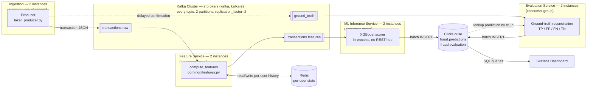

# Real-Time Fraud Detection System — Complete Project Documentation

> This document is written so you can walk into an interview, explain this project end-to-end, and answer follow-up questions confidently. Every non-trivial technical term has a plain-English explanation in brackets the first time it shows up.

---

## 1. Project Overview

### 1.1 What is this project?

A **real-time fraud detection pipeline** — a system that simulates financial transactions happening live, computes behavioral features about each transaction as it arrives, scores it for fraud probability using a trained machine learning model, stores every scored transaction, and visualizes fraud activity on a live dashboard.

Think of it like this: every time someone swipes a card, a fraud engine somewhere has milliseconds to decide "is this normal, or should we block it?" This project is a scaled-down, self-contained version of that kind of system — the same architecture pattern real payment companies (Visa, Stripe, banks) use, built with open-source tools.

### 1.2 Why does this project exist? (the elevator pitch)

Fraud detection has two hard requirements that pull in opposite directions:

1. **It has to be fast** — a decision has to be made in real time, transaction by transaction, not in a nightly batch job.
2. **It has to be smart** — it needs to know a user's *history* (their usual spending amount, usual location, usual merchants) to tell whether *this* transaction looks abnormal for *that specific person*.

This project demonstrates how to solve both: a **streaming pipeline** (data flows continuously through a pipe, processed as it arrives, instead of being collected and processed later in bulk) does the "fast" part, and a **stateful feature engineering layer backed by Redis** (an in-memory database used here to remember per-user history between transactions) does the "smart" part, feeding a pre-trained **XGBoost model** (a fast, tree-based machine learning algorithm, very popular for structured/tabular data like this) that outputs a fraud probability.

### 1.3 The end-to-end flow in one sentence

> A **producer** generates fake but realistic transactions → pushes them onto **Kafka** (a message broker: a system that reliably passes messages from producers to consumers, decoupling the two) → a **consumer** reads each transaction, computes ~29 fraud-relevant features using per-user state stored in **Redis**, calls the **ML service** (a small web API wrapping the trained model) to get a fraud probability → the enriched, scored transaction is written to **ClickHouse** (a columnar database built for fast analytics on large volumes of data) → **Grafana** (a dashboarding/visualization web app) queries ClickHouse continuously to show live charts.

### 1.4 Why this looks good in an interview

This single project touches almost every buzzword a data/backend/ML-adjacent interviewer wants to hear about: event streaming, stateful stream processing, feature engineering, ML model serving, columnar analytics storage, containerized microservices, and observability/dashboarding. It's a genuine **microservices architecture** (an application split into small, independently deployable services that each do one job and talk to each other over the network) — not a single monolithic script.

---

## 2. Tech Stack (and why each piece was chosen)

| Component | Technology | One-liner: what it is | Why it's here |
|---|---|---|---|
| Message broker | **Apache Kafka** | A distributed log that producers write to and consumers read from, decoupling the two sides | Lets the producer and consumer run at different speeds/independently; buffers bursts of transactions |
| Coordination service | **ZooKeeper** | A coordination service Kafka (this version) relies on to manage broker metadata | Required by this version of Kafka (Kafka 7.5 here still uses the older ZooKeeper-based mode, not the newer KRaft mode) |
| In-memory state store | **Redis** | An in-memory key-value database, extremely fast, often used for caching or transient state | Stores each user's running history (average spend, last location, transaction counts) between messages — this is what makes feature engineering "stateful" |
| Data generator | **Faker (Python library)** + custom script | A library that generates realistic fake data (names, locations, etc.) | Simulates a live stream of transactions without needing real financial data |
| ML model | **XGBoost** | "Extreme Gradient Boosting" — an ensemble of decision trees trained sequentially, each correcting the previous one's errors; excellent for structured/tabular data | Industry-standard choice for fraud detection on tabular features; fast to train and to run inference with |
| Model serving | **XGBoost, in-process** (no web framework) | The Kafka consumer loop calls `model.predict()` directly in the same process | An earlier version served the model behind FastAPI over HTTP; that hop was removed to cut a network call per transaction — the model loads once at startup and scores in-process |
| Analytics database | **ClickHouse** | An open-source **columnar database** (stores data column-by-column instead of row-by-row, which makes aggregate queries like `AVG()`/`COUNT()` over millions of rows very fast) | Purpose-built for the kind of "how many frauds in the last hour" aggregate queries a dashboard needs |
| Dashboard | **Grafana** | A web application for building live, auto-refreshing charts/dashboards from a database | Turns raw ClickHouse rows into a website you can watch fraud happen on |
| Containerization | **Docker** + **Docker Compose** | Docker: packages an app and everything it needs to run into a portable "container"; Docker Compose: a tool to define and run multiple containers together as one system | 15 containers total (producer, feature service, ML service, evaluation service, kafka-init all in 2 instances where applicable; ZooKeeper, 2 Kafka brokers, Redis, ClickHouse, Grafana), each in its own isolated container, wired together with one config file |

---

## 3. High-Level Design (HLD)

### 3.1 Architecture Diagram


*(ZooKeeper coordinates the 2 Kafka brokers — metadata/leader-election only, not part of the data path, so omitted above to keep the flow readable. It remains a single instance and a separate point of failure from the brokers themselves; see §6.)*

### 3.2 Component responsibilities (the "who does what")

| Service | Container name(s) | Responsibility |
|---|---|---|
| `producer` | `producer-1`, `producer-2` | Each invents realistic transactions (user, amount, merchant, location, GPS coordinates, timestamp) at 12 TX/sec for a disjoint slice of simulated user IDs, publishes to `transactions.raw`, and publishes a delayed ground-truth confirmation to `ground_truth`. Injects fraud at a 2% rate. |
| `zookeeper` | `zookeeper` | Coordinates Kafka broker metadata (leader election, topic configs). Single instance — a separate point of failure from the brokers themselves. |
| `kafka` | `kafka`, `kafka-2` | Two-broker Kafka cluster; every topic has `replication_factor=2`, so losing either broker doesn't lose data or availability (verified — see §6) |
| `redis` | `redis` | Stores per-user rolling state: running mean/variance of spend, last known location/time, transaction counts, location/merchant frequency counts |
| `feature_service` | `feature-service-1`, `feature-service-2` | Consumer group reading `transactions.raw`: computes 29 ML features per transaction using Redis state (`common/features.py`, shared with the offline dataset generator), publishes the enriched record to `transactions.features` |
| `ml_service` | `ml-service-1`, `ml-service-2` | Consumer group reading `transactions.features`: scores each with the XGBoost model **in-process** (no HTTP hop), writes `(probability, predicted_label)` to ClickHouse's `fraud.predictions` |
| `evaluation_service` | `evaluation-service-1`, `evaluation-service-2` | Consumer group reading `ground_truth`: looks up the matching prediction in ClickHouse by `transaction_id`, classifies it TP/FP/FN/TN, writes the result to `fraud.evaluation` — this is what makes live precision/recall measurable |
| `clickhouse` | `clickhouse` | Stores every scored + evaluated transaction permanently, in a schema optimized for fast aggregate queries |
| `grafana` | `grafana` | Auto-provisioned dashboard querying ClickHouse every 10 seconds to show live stats and charts |

### 3.3 Why a pipeline instead of "one script that does everything"?

This is a classic **separation of concerns** interview talking point:

- **Every stage is decoupled by Kafka.** If the feature service, ML service, or evaluation service crashes or falls behind, messages queue up in their topic instead of being lost — this is called **backpressure handling**. Restart any one of them and it resumes from its last committed offset.
- **The ML model is served independently** (`ml_service`), not imported directly into the feature service's code. This means the model can be updated, scaled, or replaced without touching the streaming/feature-engineering logic — a real-world team would have a separate ML team owning that service.
- **ClickHouse is separate from the operational database (Redis).** Redis holds only the small amount of *live* state needed to score the *next* transaction; ClickHouse holds the full historical record for analytics. Using one database for both would be slow for one of the two use cases.

### 3.4 Data flow — concrete walkthrough of a single transaction

1. A producer creates: `{"user_id": 104, "amount": 414.39, "merchant": "BestBuy", "location": "NY", "lat": 40.7128, "lon": -74.006, "timestamp": "2026-07-19T17:23:34", "transaction_id": "..."}` and publishes it to `transactions.raw`. It also schedules a delayed ground-truth confirmation (5-30s later) to the `ground_truth` topic, simulating how real fraud confirmations lag behind the transaction itself.
2. A `feature-service` instance (one of 2, in `feature-service-group`) picks it up.
3. It fetches user 104's stored history from Redis (e.g., "average spend $320, last seen in NY 3 hours ago, home location NY") and computes 29 features — is this amount unusually high for this user? (**z-score**: a statistics measure of how many standard deviations a value is from the mean) Is the travel speed since the last transaction physically impossible? Is this a new merchant? Is it night time? Etc.
4. It updates Redis with this transaction's info (new running average, new last-seen location, etc.) so the *next* transaction from user 104 sees fresh history, then publishes the enriched record to `transactions.features`.
5. An `ml-service` instance (one of 2, in `ml-service-group`) picks it up, runs the XGBoost model **in-process** (no HTTP hop — the model is loaded once at startup), and gets `{"probability": 0.18, "predicted_label": 0}` using the metadata-configured threshold.
6. It batches scored rows (100 rows or 2 seconds, whichever first) and bulk-inserts into ClickHouse's `fraud.predictions` table.
7. Separately, once the delayed ground-truth message for this transaction arrives on `ground_truth`, an `evaluation-service` instance looks up the matching row in `fraud.predictions` by `transaction_id`, classifies it TP/FP/FN/TN against the actual label, and inserts the result into `fraud.evaluation` — this closed loop is what makes live precision/recall measurable at all (see `THRESHOLD_RECALIBRATION_REPORT.md`).
8. Grafana, refreshing every 10 seconds, re-runs its SQL queries against ClickHouse and the charts update.

---

## 4. Low-Level Design (LLD)

### 4.1 Producer — `producer/faker_producer.py`

**Purpose:** simulate a realistic, continuous stream of card transactions, including a small percentage of clearly fraudulent ones, without any real user data.

Runs as **2 independent instances** (`producer-1`, `producer-2`), each owning a disjoint slice of the simulated `user_id` space (100–124 and 125–150 respectively, via `USER_ID_MIN`/`USER_ID_MAX`). This isn't just for throughput — if two producers both generated transactions for the same user, their updates to that user's "last transaction time" could arrive out of causal order (the feature service's Redis state is shared/global), producing a negative `hours_since_last_tx` that blows up `log1p()`. Partitioning the user space sidesteps that race entirely while still letting both producers scale independently.

Key logic:
- Maintains an in-process dictionary `user_profiles` per instance (home location, preferred merchants, last transaction time) — this is *separate* from the feature service's Redis state; the producer just uses it to generate believable behavior, not to do any fraud detection itself.
- Generates `TX_PER_SECOND` transactions/second per instance (12 by default — see `docker-compose.yml`), roughly once per second.
- **2% of transactions** are deliberately fraudulent. Rather than always stacking every fraud signal at once — which would make every fraud case trivially obvious to the model and inflate live precision/recall far above what the model actually achieves on real, more varied fraud (see `model_metadata.json`'s test-set numbers) — each fraudulent transaction is randomly assigned one of **4 profiles**, each tripping a different, narrower subset of signals:
  - `obvious` — impossible travel + high-risk merchant (`Casino`/`Foreign_Site`/`Luxury_Store`) + very high amount ($1,000–$8,000)
  - `travel_only` — only the location/travel signal is anomalous
  - `merchant_only` — stays home, ordinary amount, only merchant risk is anomalous
  - `amount_only` — familiar merchant/location, only a moderately elevated amount ($600–$1,500)
- For normal (non-fraud) transactions, uses the **Haversine formula** (great-circle distance between two GPS coordinates) to sanity-check that the generated travel doesn't imply a physically impossible speed (>1,200 km/h) — if it would, the location snaps back to the user's home instead.
- Publishes each transaction as JSON to the `transactions.raw` topic via `kafka-python`'s `KafkaProducer`, bootstrapped against **both** brokers (`kafka:9092,kafka-2:9092`).
- Separately, schedules a **delayed ground-truth confirmation** for every transaction (5–30s later, tracked in a min-heap keyed by ready time) published to the `ground_truth` topic — simulating how real fraud confirmations lag behind the transaction itself. Each producer only ever confirms transactions it created itself, so the two instances can never race on the same `transaction_id`.
- Retries the Kafka connection up to 15 times with a 2-second backoff on startup.

### 4.2 Kafka topic design

Topics are provisioned once, up front, by the one-shot `kafka-init` service (`kafka_init/create_topics.py`) — every downstream service gates on it via `depends_on: condition: service_completed_successfully`, avoiding Kafka's default auto-create (which would give 1 partition and defeat the point of the multi-instance consumer groups below).

| Topic | Partitions | Replication factor | Written by | Read by (consumer group) |
|---|---|---|---|---|
| `transactions.raw` | 2 | 2 | producer | feature service (`feature-service-group`) |
| `transactions.features` | 2 | 2 | feature service | ML service (`ml-service-group`) |
| `ground_truth` | 2 | 2 | producer (delayed) | evaluation service (`evaluation-service-group`) |

- **2 partitions per topic** matches the 2 running instances of each downstream service — each partition is only ever consumed by one instance within a group, so this is the parallelism ceiling today (see §6 for the scaling caveat around message keys).
- **`replication_factor=2`** across the 2-broker Kafka cluster (`kafka`, `kafka-2`) means losing either broker doesn't lose data or availability — verified by actually killing `kafka-2` mid-run (§6).
- Every consumer group uses `auto_offset_reset="latest"` (a new consumer only sees messages produced *after* it started, not the entire backlog — appropriate for a live dashboard, not historical replay) and `enable_auto_commit=True`.
- All producers/consumers bootstrap against **both** brokers (`KAFKA_BROKER: kafka:9092,kafka-2:9092`), so they keep working if either one is unreachable.

### 4.3 Feature Service — `feature_service/feature_service.py`

Reads `transactions.raw` (consumer group `feature-service-group`, 2 instances: `feature-service-1`, `feature-service-2`), computes features via the **shared** `common/features.py` module, and publishes the enriched record to `transactions.features`. This file itself is a thin Kafka-in/Kafka-out wrapper — for each message it calls `compute_features(redis_client, tx)`, merges the result back onto the original transaction dict, and `producer.send()`s it onward. A broad `try/except` around each message logs and skips a failure rather than crashing the consumer loop (see §6 for the dead-letter-queue gap this implies). The actual feature logic — the interesting part — lives in `common/features.py`:

**Time-based features** (no state needed): `hour`, `day_of_week`, `is_weekend`, `is_night` (11pm–5am).

**Velocity features using a Redis Sorted Set** (a Redis data structure that stores members ordered by a numeric score — here, the score is the transaction's Unix timestamp):
- Key: `user:{id}:tx_times`.
- `ZCOUNT` (count members whose score falls in a range) counts how many of that user's *past* transactions (strictly before this one) fall in the last 1 hour / 24 hours → `tx_count_1h`, `tx_count_24h`.
- Only *after* counting is the current transaction's own timestamp added (`ZADD`) — this matters, because the offline training data generator counts velocity the same "before this transaction" way — and anything older than 24h is trimmed (`ZREMRANGEBYSCORE`) so the set doesn't grow forever.

**Per-user running state, stored in a Redis Hash** (key `user:{id}:state`):
- `tx_count` (count of *prior* transactions, not including this one), running sum and sum-of-squares of amount (`total_amount`, `total_amount_sq` — see the z-score formula below), last latitude/longitude/timestamp/location/merchant, and `home_location` (recomputed each time as the user's *most frequent* location so far, not just the first one seen).
- There's no separate "first transaction" branch — a brand-new user simply has an empty Redis hash, and every `.get(field, default)` naturally falls back to the same defaults the training generator's fresh in-memory dict would have. This mirrors `Syn_dataset/dataset_generator.py`'s `build_features()` exactly, which also has one unified formula path rather than a special-cased cold start.

**Amount anomaly (z-score) features**, computed only once a user has more than 5 prior transactions (matching the training data's own rule — too little history makes a z-score meaningless):
```
avg = total_amount / tx_count
variance = (total_amount_sq / tx_count) - avg**2
std = max(variance, 0) ** 0.5
amount_zscore = (amount - avg) / max(std, 1.0)   # std floored at 1.0 to avoid blow-ups
```
Important subtlety: **`total_amount`/`total_amount_sq`/`tx_count` reflect history strictly *before* this transaction** — otherwise every transaction would be compared against a baseline that already includes itself, which would understate how anomalous it really is. Redis state is updated *after* all features for the current transaction are computed. A defensive `max(..., 0.0)` floor on `hours_since_last_tx` also guards against clock-skew-induced out-of-order arrivals producing a negative delta (which would otherwise blow up `log1p()`).

**Location & travel features:**
- `distance_from_last_tx` via the Haversine formula (capped at 20,000 km).
- `travel_speed = distance / hours_since_last_tx` (capped at 10,000 km/h).
- `is_impossible_travel = 1` if that implied speed exceeds **800 km/h** (faster than a commercial jet) — a classic, intuitive fraud signal: "this person can't physically be in two far-apart places within that time gap."
- `location_mismatch_home` / `location_mismatch_last`, `location_frequency` (what fraction of this user's past transactions were at this same location), `is_new_location`.
- `home_location` isn't fixed at the user's first-ever location — it's **recomputed after every transaction** as whichever location has the highest running count for that user (an evolving "mode", not a frozen first-seen value).

**Merchant features:** `merchant_risk` is a **3-level scale** (3 = high-risk: `Casino`, `Foreign_Site`; 2 = medium-risk: `Luxury_Store`, `Electronics_Hub`; 1 = everything else), `merchant_frequency`, `is_new_merchant` — same frequency-counting pattern as location, using a second Redis hash (`user:{id}:merch_counts`).

### 4.4 ML Inference Service — `ml_service/ml_inference_service.py`

Reads `transactions.features` (consumer group `ml-service-group`, 2 instances: `ml-service-1`, `ml-service-2`) and scores each message **in-process** — there is no HTTP API here at all. (An earlier version of this project routed scoring through a FastAPI `/predict` endpoint; that hop was removed since the model runs fine in the same process as the Kafka consumer and it cuts one network call per transaction.)

- Loads the XGBoost model (`fraud_model.json`) and `model_metadata.json` **once at process startup**, not per-message — model loading is the expensive part, so it's done exactly once per instance and reused for every prediction.
- For each transaction, builds a row in the exact `feature_columns` order from the metadata, wraps it in an XGBoost **DMatrix**, and compares the resulting probability against the pre-computed **optimal threshold** (`0.7867`, recalibrated for live fraud prevalence — see §4.6) to produce a binary `predicted_label`.
- The model file and metadata are mounted into the container as **read-only volumes** rather than baked into the image — you can swap in a retrained model by replacing the file on the host, without rebuilding the image.
- **Batch inserts into ClickHouse's `fraud.predictions`** rather than one `INSERT` per transaction: buffers scored rows in memory and flushes when either the buffer reaches 100 rows or 2 seconds have passed since the last flush, whichever comes first — a standard **micro-batching** trade-off between latency and write throughput (ClickHouse is optimized for bulk inserts, not high-frequency single-row writes).

### 4.5 Evaluation Service — `evaluation_service/evaluation_service.py`

Reads `ground_truth` (consumer group `evaluation-service-group`, 2 instances) and closes the loop: for each ground-truth confirmation, it looks up the matching row in `fraud.predictions` by `transaction_id`, classifies it against the real `actual_label`, and writes the result to `fraud.evaluation`. This is what makes live precision/recall on the Grafana dashboard a real, measurable number instead of just the model's offline test-set claim.

- **Classification:** `TP`/`TN`/`FP`/`FN` from comparing `predicted_label` vs `actual_label`.
- **Retry queue for late-arriving predictions:** a ground-truth message can arrive before the ML service has finished scoring and inserting the corresponding row (ClickHouse insert latency, batching delay, etc.). Rather than blocking the main consume loop with `sleep()` — which would stall the whole partition for every miss — an unresolved lookup is pushed onto a min-heap of `(retry_at, seq, attempts, message)` and retried up to 3 times, 1 second apart, without blocking new messages from being consumed. `seq` (from `itertools.count()`) is a tie-breaker so `heapq` never has to compare two message dicts directly when `retry_at`/`attempts` collide — dicts aren't orderable in Python.
- After 3 failed attempts, the ground-truth message is dropped and logged as missing (counted, not silently swallowed) — another instance of the dead-letter-queue gap noted in §6.
- **Batch inserts** into `fraud.evaluation` using the same 100-rows-or-2-seconds rule as the ML service.

### 4.6 The Model — training, features, and metrics

The model itself was trained **outside this repository's runtime path** — this project ships the *already-trained* model (`fraud_detection_model.json`) plus a `Syn_dataset.zip` containing the synthetic training data (`fraud_dataset_5l.csv`, 500,000 rows — "5L" is Indian numbering shorthand for 5 *lakh* = 500,000) and the generator script used to build it (`dataset_generator.py`).

**Algorithm:** XGBoost (gradient-boosted decision trees). Key training hyperparameters from `model_metadata.json`:
- `n_estimators=300` (300 trees), `max_depth=6`, `learning_rate=0.05`
- `scale_pos_weight≈6.66` — a technique to compensate for **class imbalance** (fraud is much rarer than legitimate transactions in the training data — roughly 1-in-7 weighting tells the model "treat missing a fraud case as ~6.66x worse than a false alarm")
- `eval_metric="auc"` with `early_stopping_rounds=30` (stop training once validation performance stops improving for 30 rounds, to avoid **overfitting** — memorizing the training data instead of learning generalizable patterns)

**The 29 features** (grouped, matching `model_metadata.json`'s `feature_columns`):
- *Amount:* `amount`, `amount_log` (log-transformed, since raw dollar amounts are heavily right-skewed), `amount_zscore`, `amount_ratio_to_avg`, `is_round_amount`, `is_very_high`
- *Time:* `hour`, `day_of_week`, `is_weekend`, `is_night`
- *Recency/velocity:* `hours_since_last_tx`, `hours_since_last_tx_log`, `is_rapid_tx`, `tx_count_1h`, `tx_count_24h`, `total_tx_count`, `is_first_tx`
- *Location:* `location_mismatch_home`, `location_mismatch_last`, `distance_from_last_tx`, `distance_from_last_tx_log`, `travel_speed`, `travel_speed_log`, `is_impossible_travel`, `location_frequency`, `is_new_location`
- *Merchant:* `merchant_risk`, `merchant_frequency`, `is_new_merchant`

**Reported performance** (from `model_metadata.json`, on the original held-out test set, which has a **13% fraud rate** — see the calibration note below for why that number matters):

| Metric | Value | Plain meaning |
|---|---|---|
| **AUC** (Area Under the ROC Curve) | 0.842 | Probability the model ranks a random fraud case as riskier than a random legit case; 0.5 = coin flip, 1.0 = perfect |
| **AP** (Average Precision) | 0.460 | Similar to AUC but more informative on imbalanced data — summarizes the precision/recall curve |
| **Optimal F1** | 0.432 | Harmonic mean of precision and recall at the chosen threshold — balances "catching fraud" vs "not crying wolf" |
| **Precision** | 0.295 | Of everything flagged as fraud, ~29.5% actually was fraud — **on the 13%-fraud test set only, see below** |
| **Recall** | 0.806 | Of all actual fraud, the model catches ~80.6% of it |
| **False alarm rate** | 0.292 | ~29.2% of legitimate transactions get incorrectly flagged |

**Independently reproduced (not just taken on faith):** the model file was reloaded and re-scored against the full 500k-row `fraud_dataset_5l.csv` (fraud rate 13.1%) using `sklearn` metrics, outside of this project's runtime. Results matched the reported test metrics closely — **AUC 0.844, F1 0.434, precision 0.296, recall 0.816, false alarm rate 0.293** — confirming the shipped model file and metadata are internally consistent and the reported numbers are genuine, not just aspirational. (Caveat: this re-scoring ran over the same data the model may have been trained on, since the original train/test split indices weren't shipped with the repo — so treat it as a *consistency check*, not an independent validation. `model_metadata.json`'s numbers remain the trustworthy out-of-sample benchmark.)

**Why this precision/recall trade-off is a deliberate, defensible choice (great interview talking point):** in fraud detection, missing real fraud (a **false negative**) is usually far more costly than a false alarm (a **false positive**) — a false alarm might mean a small manual review, while a missed fraud means real money lost. The `scale_pos_weight` and the chosen decision threshold were tuned to **favor recall over precision** — catch a high fraction of fraud even if it means a decent chunk of false alarms. This is the standard trade-off framing to bring up if asked "why not just get 99% accuracy?" — with fraud this rare, a model that predicts "never fraud" would already be >95% accurate and completely useless; **accuracy is the wrong metric** for imbalanced problems like this, which is why AUC/precision/recall/F1 are used instead.

**⚠️ Threshold recalibration — training prevalence vs. live prevalence (important, and a great "what did you debug" interview story):** `dataset_generator.py` injects synthetic fraud at a 5% base rate, which (after probabilistic labeling/noise) yields the ~13% `fraud_label` rate seen above. `producer/faker_producer.py`, which simulates *live* traffic, injects fraud at only **2%**. Recall is prevalence-invariant (it's computed only over the positive class), so it transfers from the 13%-fraud test set to the 2%-fraud live stream basically unchanged. **Precision is not** — it depends on how many legitimate transactions surround each fraud case, so the same model, at the same threshold, looks dramatically worse on precision once deployed against rarer real-world fraud. Concretely, the original threshold (0.51) reprojects via Bayes' theorem (`precision(π) = π·TPR / (π·TPR + (1-π)·FPR)`) from 29.5% precision at 13% prevalence down to **~5.4% precision at 2% prevalence** — matching what was actually observed live. The model itself (`fraud_detection_model.json`, AUC 0.842) was never retrained to fix this — only `optimal_threshold` in `model_metadata.json` was recalibrated (via `scripts/recalibrate_threshold.py`) to **0.7867**, chosen as the threshold maximizing F1 subject to a 10% precision floor *at the real 2% live prevalence*. That trades recall down to ~32% for precision up to ~14% — both figures under `model_metadata.json` → `performance_live_2pct`. Full derivation and proofs: `THRESHOLD_RECALIBRATION_REPORT.md`.

**✅ Train/serve parity (previously a bug, now fixed):** the live feature service's feature engineering (`common/features.py`) was rewritten to mirror `dataset_generator.py`'s formulas exactly — `merchant_risk`'s 3-level scale, the `is_night`/`is_round_amount`/`is_very_high` thresholds, the 720-hour and 20,000 km cold-start/cap constants, the 800 km/h impossible-travel threshold, the "history excludes the current transaction" convention for counts/frequencies, and the evolving (mode-based) `home_location` — are now identical on both sides. This was verified by rebuilding the feature service and inspecting live ClickHouse rows (e.g. `merchant_risk` now cleanly maps `Casino`/`Foreign_Site` → 3, `Luxury_Store`/`Electronics_Hub` → 2, everything else → 1, with no stray 0/1 values).

### 4.7 Redis — data model summary

| Key pattern | Type | Purpose |
|---|---|---|
| `user:{id}:state` | Hash | Running stats: prior tx count, amount sum/sum-of-squares, last lat/lon/timestamp/location/merchant, home location (recomputed each write) |
| `user:{id}:loc_counts` | Hash | `{location: count}` — for location frequency / new-location detection |
| `user:{id}:merch_counts` | Hash | `{merchant: count}` — for merchant frequency / new-merchant detection |
| `user:{id}:tx_times` | Sorted Set | Timestamps of recent transactions, scored by Unix time, trimmed to a rolling 24h window — for velocity features |

Redis was chosen over just querying ClickHouse for this because **this state needs sub-millisecond read/write for every single transaction**, and it's small, transient, "hot" data — a textbook use case for an in-memory key-value store rather than a disk-backed analytical database.

### 4.8 ClickHouse — schema design

The schema is split into **two purpose-built tables** rather than one wide table — each one's `ORDER BY` is chosen for the specific access pattern that hits it (`clickhouse/init.sql`):

```sql
-- Point-lookup-optimized: the evaluation service does WHERE transaction_id = ?
-- once per ground-truth message, so transaction_id must lead ORDER BY.
CREATE TABLE fraud.predictions (
    transaction_id String, timestamp DateTime, merchant String, amount Float64,
    fraud_probability Float64, predicted_label UInt8,
    processed_at DateTime DEFAULT now()
)
ENGINE = MergeTree()
ORDER BY (transaction_id);

-- Time-range-optimized: Grafana only does WHERE $__timeFilter(timestamp) GROUP BY ...
CREATE TABLE fraud.evaluation (
    transaction_id String, timestamp DateTime, merchant String, amount Float64,
    predicted_label UInt8, actual_label UInt8, fraud_probability Float64,
    correct_prediction UInt8, classification LowCardinality(String),  -- 'TP'/'TN'/'FP'/'FN'
    evaluated_at DateTime DEFAULT now()
)
ENGINE = MergeTree()
ORDER BY (timestamp, transaction_id)
PARTITION BY toYYYYMM(timestamp);
```

- **`MergeTree`** is ClickHouse's main **storage engine** — optimized for high insert throughput and fast range/aggregate queries.
- **`fraud.predictions`** is deliberately narrow (no engineered features persisted — only the prediction output) and ordered by `transaction_id` because its only query pattern is a point lookup by ID, done once per ground-truth confirmation by the evaluation service. Sorting it by time instead would mean every one of those lookups scans the whole table.
- **`fraud.evaluation`** is the table Grafana actually queries, so it's ordered `(timestamp, transaction_id)` and partitioned `toYYYYMM(timestamp)` — the standard shape for a table whose queries are almost all "aggregate over a time range," letting ClickHouse skip whole blocks/partitions outside the queried window.
- Choosing the sort key per table for its actual query pattern — rather than one shared schema for everything — is a deliberate ClickHouse-specific trade-off: the 29 raw engineered features never get persisted at all, since nothing here needs to query by them after the fact.

### 4.9 Grafana — dashboard design

- **Datasource:** the official `grafana-clickhouse-datasource` plugin, auto-installed via the `GF_INSTALL_PLUGINS` environment variable, connecting over ClickHouse's **native protocol** on port 9000 (faster, binary protocol, vs. the HTTP interface on port 8123).
- **Provisioning:** both the datasource and the dashboard itself are defined as YAML/JSON files under `grafana/provisioning/` and mounted into the container. This means the whole dashboard is **"infrastructure as code"** — nobody has to manually click through the Grafana UI to set it up; `docker compose up` reproduces the exact same dashboard every time.
- **Panels** (querying `fraud.predictions` and `fraud.evaluation`): Prediction Count (all-time), Evaluation Count (time range), Fraud Rate (%), Accuracy (%), Precision (%), Recall (%), True Positives, True Negatives, False Positives, False Negatives, Transactions/sec (Evaluated), Predicted Frauds/sec, Confirmed Frauds/sec, and a Fraud Probability Distribution histogram — i.e. the dashboard is built around the **confusion matrix** the evaluation service produces, not just raw transaction counts, so precision/recall are live numbers you can point to, not just claims from `model_metadata.json`.
- Auto-refreshes every 10 seconds, giving the "live" feel.

### 4.10 Docker Compose — how it all gets wired together

- One `docker-compose.yml` at the repo root defines **15 containers** — ZooKeeper, 2 Kafka brokers, the one-shot `kafka-init`, Redis, ClickHouse, Grafana, 2 producer instances, 2 feature-service instances, 2 ML-service instances, and 2 evaluation-service instances — all on a single custom bridge network (`fraud-net`). Containers reach each other by service name (e.g. `kafka:9092`, `redis:6379`, `clickhouse:8123` — Docker's built-in DNS resolves these to the right container).
- **Explicit `mem_limit`s and shrunk JVM heaps** on ZooKeeper/Kafka/ClickHouse (see the comment block at the top of `docker-compose.yml`) — with 15 containers on one host, Confluent's default heap sizes were enough to get Kafka OOM-killed during validation; the demo's actual throughput needs nowhere near the defaults.
- **No `HEALTHCHECK`s are defined** in any service's Dockerfile currently — readiness is handled entirely by each service's own retry/backoff loop on startup (waiting for Kafka/Redis/ClickHouse to accept connections), not by Docker-level health status.
- **`depends_on`** controls *start order* only — it does **not** guarantee the dependency is actually *ready* to accept connections yet. `kafka-init` is the one exception, gated on `condition: service_completed_successfully` so topics definitely exist before any producer/consumer starts; every other service relies on its own retry/backoff loop instead of `depends_on` alone.
- **Named volumes** (`clickhouse_data`, `grafana_data`) persist data across container restarts — without them, restarting a container would wipe its data since containers are otherwise ephemeral.
- **`restart: unless-stopped`** on the long-running services means Docker restarts a crashed container automatically (and brings everything back after a host reboot, as long as the Docker daemon itself starts on boot) without needing a separate process supervisor.

---

## 5. Design Decisions & Trade-offs (common interview follow-ups)

**Q: Why Kafka instead of just writing directly from the producer to the consumer, or to the database?**
A: Kafka decouples producer and consumer rates and gives durability — if the consumer is down for maintenance or crashes, transactions aren't lost, they queue up in Kafka and get processed once it's back. It also would let you add more consumers later (e.g., one for fraud scoring, another for a separate audit log) without touching the producer at all.

**Q: Why Redis for state instead of just querying ClickHouse for "this user's last transaction"?**
A: Every single transaction needs a read + write of user state, at up to 50/second. ClickHouse is a columnar analytics store optimized for scanning millions of rows in bulk, not for single-row point lookups/updates at that frequency — Redis, an in-memory key-value store, is built exactly for this access pattern (O(1)-ish reads/writes).

**Q: Why ClickHouse instead of Postgres/MySQL for storage?**
A: The dashboard's queries are almost all aggregates over large time ranges (`COUNT()`, `AVG()`, `GROUP BY minute`). Columnar databases like ClickHouse read only the columns a query touches, compress well, and are dramatically faster for this workload than row-oriented databases, at the cost of being worse for single-row transactional updates — which is fine here, since this table is insert-only.

**Q: Why batch inserts instead of one insert per transaction?**
A: ClickHouse documentation explicitly recommends batching — issuing thousands of tiny single-row inserts per second creates excessive background merge work and hurts performance. Buffering ~100 rows or 2 seconds (whichever comes first) is a simple, standard micro-batching trade-off between latency and throughput.

**Q: Why XGBoost instead of a neural network / logistic regression?**
A: The data here is tabular (rows and columns, not images/text/sequences) — gradient-boosted trees like XGBoost are consistently state-of-the-art for tabular data, train fast, need less data than deep learning, and are more interpretable (feature importances) than a neural net, which matters in fraud (regulators/analysts want to know *why* a transaction was flagged).

**Q: How would you scale this to handle 1000x the transaction volume?**
A: Increase partition counts on `transactions.raw` / `transactions.features` / `ground_truth`, and add more instances to whichever consumer group is the bottleneck (`feature-service-group`, `ml-service-group`, `evaluation-service-group`) — each partition is only ever read by one consumer within a group, so more partitions + more replicas = parallel processing, and today's 2/2 split is nowhere near that ceiling. None of these services expose an HTTP API to scale behind a load balancer anymore — scaling is purely "add container replicas." ClickHouse can be **sharded** (data split across multiple servers) and **replicated**. Redis can be clustered.

**Q: What happens if the ML service (or feature service, or evaluation service) is down or throws on a message?**
A: Each of the three services wraps its per-message processing in a broad `try/except` — a failure (bad data, ClickHouse temporarily unreachable, etc.) is logged and that single message is skipped, not retried or written anywhere. This is a real gap: in production you'd want a **dead-letter queue** (a separate place to stash failed messages for later inspection/replay) instead of silently dropping them. The evaluation service goes one step further with a bounded retry queue for the specific case of a ground-truth message arriving before its prediction exists (§4.5) — but that's a narrow fix for a known race, not a general dead-letter mechanism.

---

## 6. Known Limitations & What You'd Improve (great material for "what would you do differently?")

Being able to critique your own project's rough edges is one of the strongest signals in an interview — it shows real understanding, not memorized talking points. This project's honest limitations:

1. **No dead-letter queue** — failed messages (ClickHouse temporarily down, bad data) are dropped silently rather than retried or stored for investigation, in the feature, ML, and evaluation services alike.
2. **No message key when publishing to Kafka** — `producer.send(TOPIC_RAW, transaction)` doesn't pass a `key`, so Kafka's default partitioner spreads a given user's transactions round-robin across both partitions rather than keying by `user_id`. That means one user's transactions aren't guaranteed to land on the same partition or be processed in order by the same feature-service instance. This is only partially mitigated today: `common/features.py` defensively floors `hours_since_last_tx` at 0 rather than assuming causal order (see its comment on clock-skew), but a real system would key by `user_id` for deterministic per-user ordering and treat that defensive floor as a backstop, not the primary safeguard.
3. **No authentication/security** — Grafana uses default `admin/admin`, Kafka/Redis/ClickHouse have no auth enabled. Fine for a local demo, not for anything internet-facing.
4. **No automated tests** — no unit tests for feature computation, no integration tests for the pipeline. Would add `pytest` tests for `compute_features()` (easy to unit test in isolation) and a smoke test that runs the whole Docker Compose stack in CI.
5. **No model retraining/versioning pipeline** — the model is a static file; a production system would have a scheduled retraining job and a model registry (e.g., MLflow) to track versions and roll back if a new model underperforms.
6. **Single point of failure — partially addressed for Kafka, still open elsewhere.** Kafka now runs 2 brokers (`kafka`, `kafka-2`) with every topic (including the internal `__consumer_offsets`) at `replication_factor=2`, and all producers/consumers bootstrap against both brokers (`KAFKA_BROKER: kafka:9092,kafka-2:9092`). Verified by actually killing `kafka-2` mid-run: produce/consume (including via a real consumer group) kept working against the surviving broker with zero message loss. ZooKeeper (the coordination layer Kafka depends on), Redis, and ClickHouse remain single instances with no replication — any one of *those* dying still takes that service down until it restarts. Note this is running on a memory-constrained host (~3.8GB RAM) where a second Kafka JVM broker measurably tightens headroom (swap usage rose from ~1.4GB to ~2.3GB with the full 15-container stack up) — worth checking available memory before adding further replicas.
7. **Feature engineering is still duplicated** — `common/features.py` (imported live by `feature_service`) intentionally mirrors `Syn_dataset/dataset_generator.py`'s formulas (used offline to build the training dataset) by hand rather than both importing one shared module; `dataset_generator.py` doesn't import from `common/` at all. The two were carefully aligned once (§4.6's train/serve parity note), but nothing enforces they stay aligned if either changes. The more maintainable fix would have the offline generator import `common/features.py` directly, so there is exactly one implementation to change when a feature definition evolves.

---

## 7. Quick Reference: File-by-File Map

```
Real_Time_Fraud_Detection/
├── docker-compose.yml               # Wires all 15 containers together
├── common/
│   ├── __init__.py
│   └── features.py                  # Shared compute_features() -- used live by feature_service
├── kafka_init/
│   ├── create_topics.py             # One-shot: creates the 3 topics before anything else starts
│   ├── requirements.txt
│   └── Dockerfile
├── producer/
│   ├── faker_producer.py            # Generates fake transactions + delayed ground-truth -> Kafka (2 instances)
│   ├── requirements.txt
│   └── Dockerfile
├── feature_service/
│   ├── feature_service.py           # transactions.raw -> compute_features() -> transactions.features (2 instances)
│   ├── requirements.txt
│   └── Dockerfile
├── ml_service/
│   ├── ml_inference_service.py      # transactions.features -> XGBoost (in-process) -> fraud.predictions (2 instances)
│   ├── fraud_detection_model.json   # The trained model itself
│   ├── model_metadata.json          # Feature list, threshold, training params, test metrics
│   ├── requirements.txt
│   └── Dockerfile
├── evaluation_service/
│   ├── evaluation_service.py        # ground_truth -> lookup + classify TP/FP/FN/TN -> fraud.evaluation (2 instances)
│   ├── requirements.txt
│   └── Dockerfile
├── clickhouse/
│   └── init.sql                     # Creates fraud.predictions and fraud.evaluation on first boot
├── grafana/
│   └── provisioning/
│       ├── datasources/                 # Auto-configures the ClickHouse datasource
│       └── dashboards/                  # Dashboard JSON + provisioning config
├── scripts/
│   └── recalibrate_threshold.py     # Recomputes optimal_threshold for live (2%) fraud prevalence
├── Syn_dataset/
│   ├── dataset_generator.py         # Standalone offline generator -- mirrors common/features.py by hand
│   └── fraud_dataset_5l.csv
├── Syn_dataset.zip                  # Zipped copy of the training dataset + generator
├── fraud-detection-xgboost.ipynb    # Notebook used to train/explore the XGBoost model offline
└── THRESHOLD_RECALIBRATION_REPORT.md
```

---

## 8. How to Run It (for a live demo in an interview)

```bash
docker compose up -d --build
# 15 containers total -- ZooKeeper, 2 Kafka brokers, kafka-init, Redis, ClickHouse,
# Grafana, and 2 instances each of producer/feature-service/ml-service/evaluation-service.
# kafka-init gates every downstream service until topics exist, so give it 30-60 seconds.
```

- Grafana dashboard: **http://localhost:3000** (login `admin` / `admin` — change this if you ever expose it beyond localhost, see §6)
- ClickHouse HTTP interface: **http://localhost:8123** (for ad-hoc `SELECT`s against `fraud.predictions` / `fraud.evaluation`)

None of the services expose an HTTP API of their own anymore — the ML service scores in-process now rather than behind FastAPI — so Grafana and ClickHouse's own interfaces are the only two ports worth opening in a browser.

To tear down: `docker compose down` (add `-v` to also wipe stored data/volumes).

---

## 9. One-Paragraph Summary (memorize this for "walk me through your project")

> "I built a real-time fraud detection pipeline using an event-driven microservices architecture on Kafka. Two producer instances generate realistic synthetic transactions across disjoint user ranges and stream them through a 2-broker, replicated Kafka cluster. A feature-service consumer group reads each transaction, uses Redis to maintain rolling per-user behavioral statistics — spending patterns, location history, transaction velocity — and computes 29 engineered features, shared with the offline training pipeline to avoid train/serve skew. Those features flow through Kafka again to an ML inference service that scores them in-process with a pre-trained XGBoost model and writes predictions to ClickHouse. A separate evaluation service closes the loop: it reconciles each prediction against a delayed ground-truth confirmation, classifies it TP/FP/FN/TN, and writes that too — which is what makes live precision and recall on the Grafana dashboard a real, measurable number rather than just a claim from training. I deliberately tested fault tolerance by killing one of the two Kafka brokers mid-run and confirming zero message loss. The whole system is 15 containers wired together with one Docker Compose file, fully reproducible with one command. The model itself achieves 0.84 AUC and ~80% recall on held-out test data; the decision threshold was separately recalibrated for the live 2%-fraud traffic rate versus the 13%-fraud training set, which is a good example of the kind of train/serve gap that's easy to miss."

---

## 10. Deployment Reality Check — Why This Runs Locally, Not Always-On in the Cloud

A fair question in an interview: *"so where's this deployed?"* The honest answer is: it isn't, permanently — and that's a considered trade-off, not a gap in the project.

**Why not just put it on a free-tier cloud instance?** The memory-tuning comments in `docker-compose.yml` make the real constraint concrete: 15 containers, deliberately shrunk JVM heaps, and it still swaps under load on a memory-constrained host. That's a sustained ~3-5GB RAM footprint. Every "free" compute tier that actually exists falls short of that for something meant to stay running:
- AWS/GCP/Azure's free tiers cap out around a 1GB-RAM instance class — not enough to boot ZooKeeper + 2 Kafka brokers + ClickHouse alone, let alone the rest of the stack.
- Heroku's free dyno tier was discontinued in 2022; Render/Railway's free tiers exist but sleep on inactivity and cap monthly runtime well under what a persistently-running multi-container Kafka stack needs.
- Oracle Cloud's "Always Free" ARM shape (4 OCPU/24GB) is actually big enough on paper — but it's ARM64, and every image this stack depends on (Confluent's Kafka/ZooKeeper, ClickHouse, Grafana) is published for amd64. Getting Confluent's Kafka image running well on ARM is its own side project, not a free lunch.

So "free and always-on" and "big enough for this stack" don't overlap anywhere real — the moment this needs to be reachable 24/7, it's paying for a `t3.large`-class instance (or equivalent) from hour one, free tier or not.

**So why not just pay the few dollars a month?** That would be solving a problem this project doesn't have. This is a portfolio/interview artifact — the actual requirement is "I can show this working when someone wants to see it," not "a stranger can hit an endpoint at 3am." Paying for always-on infrastructure to satisfy a requirement nobody has repeats the exact mistake this project's own design deliberately avoids elsewhere (over-provisioning for load that doesn't exist) — except here it's real money funding idle compute between interviews.

**Why running it manually — locally, or spun up for a few hours the night before — is the better call, not just the cheaper one:**
- **Zero cost by construction.** No idle compute, no lingering Elastic IP charge, no forgotten-running-instance bill.
- **No cold-start risk right before it matters.** A cloud boot depends on your internet, the cloud provider's, DNS, security groups, and 15 containers' startup ordering all cooperating in a narrow window before a live interview. `docker compose up -d` on your own machine removes every one of those extra failure points.
- **Faster to debug if something's wrong.** Full local terminal access to logs and containers beats SSH-ing into a remote box and hoping `docker compose logs` surfaces the issue in time.
- **It matches this project's own documented limitation.** §6 already flags that Grafana, Kafka, Redis, and ClickHouse run with no authentication (`admin/admin`, no TLS, no broker auth) — fine on `localhost`, genuinely risky the moment it's reachable on the open internet. Not exposing it by default is the correct engineering call here, not a workaround for a missing feature.

**The interview-ready framing:** "I designed it to run as a fully reproducible Docker Compose stack rather than deploying it to always-on cloud infrastructure, because for a project meant to be demoed on demand rather than serve real traffic, paying for 24/7 uptime doesn't buy anything — and given the stack has no auth on Kafka/Redis/ClickHouse, keeping it off the public internet by default is the safer choice anyway. If this needed real uptime, the natural next step would be a right-sized paid instance on a schedule, or trimming to a single-broker/single-replica topology to cut the cost and memory footprint — both of which I've already scoped out, not just hand-waved."
